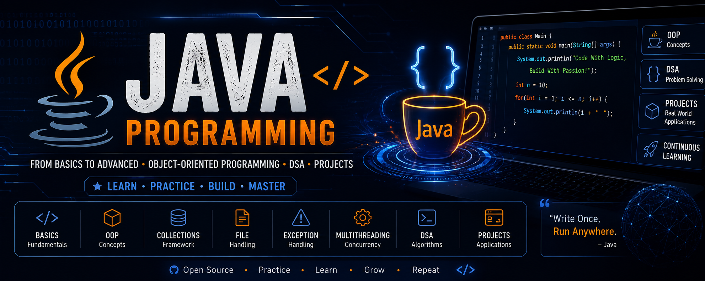

<p align="center">
  
</p>

<h1 align="center">☕ Java Programming</h1>

<h3 align="center">
From Basics to Advanced • OOP • DSA • Problem Solving
</h3>

<p align="center">

</p>

<p align="center">


</p>

---

# ⭐ Repository Highlights

- 📚 Beginner to Advanced Java Programs
- ☕ Object-Oriented Programming (OOP)
- 🧩 Data Structures & Algorithms
- 💼 Interview Preparation
- 🚀 Mini Projects
- 🌱 Spring Boot (Coming Soon)

---

# 📌 Repository Information

| Property | Value |
|----------|-------|
| Language | Java |
| IDE | IntelliJ IDEA / VS Code |
| Build Tool | None (Currently) |
| Repository Type | Learning Repository |
| Difficulty | Beginner → Advanced |
| Maintained By | Aruna Kumar Gouda |

---

# 📖 About

Welcome to my **Java Programming Repository**.

This repository contains Java programs covering everything from **basic syntax** to **advanced concepts**, including Object-Oriented Programming (OOP), Collections Framework, File Handling, Data Structures, Algorithms, and practical programming exercises.

The goal of this repository is to document my Java learning journey while creating a useful reference for students and beginners.

---

# ✨ Repository Features

- 📘 Beginner to Advanced Java Programs
- ☕ Object-Oriented Programming (OOP)
- 📚 Data Structures & Algorithms
- 💡 Problem Solving Exercises
- 🎯 Interview Preparation
- 🚀 Mini Projects
- 🧹 Clean & Readable Code

---

# 🎯 Learning Objectives

- Learn Java from Beginner to Advanced
- Master Object-Oriented Programming
- Practice Data Structures & Algorithms
- Improve Problem Solving Skills
- Build Real-World Java Projects
- Prepare for Technical Interviews

---

# 👨‍🎓 Who is this Repository for?

This repository is designed for:

- 🎓 Students learning Java
- 💻 Beginners starting programming
- 📚 Interview preparation
- ☕ Java developers
- 🚀 Java Full Stack learners

---

# 📚 Topics Covered

## 🟢 Java Basics

- Variables
- Data Types
- Operators
- Input & Output
- Conditional Statements
- Loops

## 🔵 Intermediate

- Methods
- Arrays
- Strings
- Pattern Programs
- Functions
- Recursion

## 🟠 Object-Oriented Programming

- Classes
- Objects
- Constructors
- Inheritance
- Polymorphism
- Encapsulation
- Abstraction
- Interfaces

## 🟣 Advanced Java

- Exception Handling
- Collections Framework
- File Handling
- Multithreading
- Generics
- JDBC

## 🔴 Data Structures & Algorithms

- Arrays
- Searching
- Sorting
- Linked List
- Stack
- Queue
- Trees
- Graph
- Recursion
- Dynamic Programming

---

# 🛠 Tech Stack

<p align="center">


</p>

---

# 📈 Learning Progress

```text
Java Basics          ████████████████████ 100%
OOP                  ███████████████████░ 95%
Arrays               ████████████████████ 100%
Strings              ████████████████████ 100%
Collections          ████████████████░░░░ 80%
File Handling        ██████████████░░░░░░ 70%
Multithreading       █████████░░░░░░░░░░░ 45%
Spring Boot          ███░░░░░░░░░░░░░░░░░ 15%
```

---

# 🗺️ Java Learning Roadmap

```text
            JAVA PROGRAMMING

                 │
                 ▼
         Variables & Data Types
                 │
                 ▼
              Operators
                 │
                 ▼
          Conditional Statements
                 │
                 ▼
                Loops
                 │
                 ▼
         Methods & Functions
                 │
                 ▼
         Arrays & Strings
                 │
                 ▼
       Object-Oriented Programming
                 │
                 ▼
      Exception Handling
                 │
                 ▼
     Collections Framework
                 │
                 ▼
          File Handling
                 │
                 ▼
          Multithreading
                 │
                 ▼
               JDBC
                 │
                 ▼
           Spring Boot
                 │
                 ▼
          REST API Development
                 │
                 ▼
           Microservices
                 │
                 ▼
         Real-World Projects
```

---

# 🚀 Featured Java Projects

| Project | Description |
|---------|-------------|
| 🔐 File Encryption System | Encrypt and decrypt files using Java. |
| 📚 Student Management System | CRUD operations using Java and OOP concepts. |
| 🏦 Banking Management System | Console-based banking application. |
| 📖 Library Management System | Book management system using Java. |
| 🌱 Spring Boot Projects | REST API and backend applications (Planned). |

---

# 💼 Java Skills

| Skill | Status |
|-------|:------:|
| Java Basics | ✅ |
| Object-Oriented Programming | ✅ |
| Arrays & Strings | ✅ |
| Exception Handling | ✅ |
| Collections Framework | ✅ |
| File Handling | ✅ |
| Multithreading | 🟡 Learning |
| JDBC | 🟡 Learning |
| Spring Boot | 🔄 Planned |
| Hibernate | 🔄 Planned |
| REST APIs | 🔄 Planned |

---

# 🚀 Future Plans

- 🌱 Spring Boot Applications
- 🗄 Hibernate ORM
- 🔗 JDBC Projects
- 🌐 REST APIs
- ☁ Microservices
- 🧪 JUnit Testing
- 🏗 Design Patterns
- 🚀 Enterprise Java Projects

---

# 📚 Learning Resources

- Oracle Java Documentation
- dev.java
- GeeksforGeeks Java Tutorials
- Spring Boot Documentation

---

# 🤝 Contributing

Contributions, suggestions, and improvements are always welcome.

If you'd like to contribute:

1. Fork this repository.
2. Create a new feature branch.
3. Commit your changes.
4. Open a Pull Request.

---

# ⭐ Support

If you found this repository useful:

⭐ Star this repository

🍴 Fork this repository

📢 Share it with other Java learners

Happy Coding! ☕🚀

---

<p align="center">

Made with ❤️ by <b>Aruna Kumar Gouda</b>

</p>
